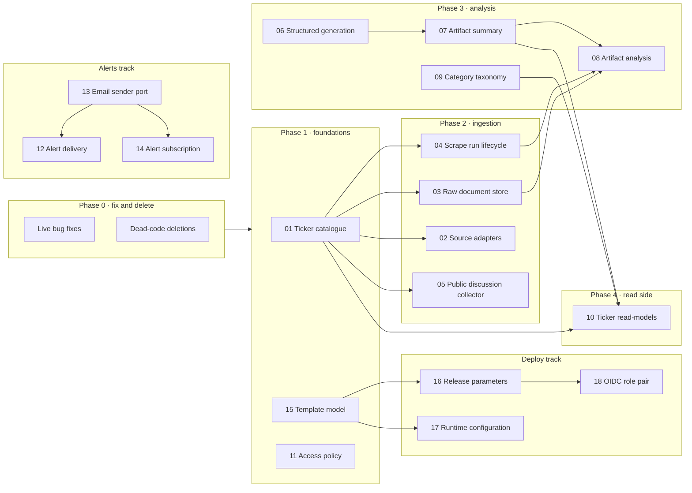

# Architecture Deepening Plan

## Baseline

- Base: `main` at `c6e7574`. Re-checked on 26 September 2026: `origin/main` has no newer commits. All line references below point at this commit.
- Scope: the areas that changed most in the last 80 commits. Those are the announcement pipeline, LLM analysis and summaries, the ticker API and read-models, investor alerts, and deployment wiring.
- Method: four reviewers read the code in parallel without changing it. The findings were then combined, and every bug marked **verified** was checked again against the code.
- Constraint: `docs/advanced-content-classification-implementation-plan.md` has already decided the classification design. `classify_document` stays the single external seam, with no provider ports. This plan builds on that decision and does not reopen it. The repo has no `CONTEXT.md` and no ADRs.
- In flight: two branches are not yet merged into `main`, and both touch `backend/app/api/routes/ticker.py` and `CitationLinks.jsx`:
  - `feature/86d2ba6e6-claim_source_traceability`
  - `feature/86d4a0a1d-specific_report_sources`

  Merge them before you start candidates 07 or 10, or those candidates will conflict with them.

## Vocabulary

These terms are used throughout the plan with the meanings below.

- **Module**: anything with an interface and an implementation. It can be a function, a class, a package, or a slice that spans several tiers.
- **Interface**: everything a caller must know to use a module correctly. That includes the types, but also invariants, ordering rules, error modes and required configuration.
- **Deep vs shallow**:
  - A deep module hides a lot of behaviour behind a small interface.
  - A shallow module has an interface nearly as complex as its implementation.
- **Seam**: the place where a module's interface sits. Behaviour can be changed there without editing the code on either side.
- **Adapter**: a concrete implementation that plugs into a seam.
  - With one adapter, the seam is only hypothetical.
  - With two adapters (typically production plus a test fake), the seam is real.
- **Locality**: knowledge, bugs and fixes concentrate in one place.
- **Leverage**: callers get more capability per unit of interface they have to learn.
- **Deletion test**: imagine deleting the module.
  - If its complexity simply disappears, the module was a pass-through.
  - If the complexity reappears across several callers, the module was earning its keep.

## Outcomes

1. Every bug listed under Phase 0 is fixed and has a regression test.
2. Adding an ASX ticker means one catalogue entry plus one source adapter, not about 20 files.
3. A transient failure in any pipeline stage never records a terminal state before SQS gives up.
4. The summary shape, the FinBERT input and the LLM provider behaviour are each defined in one module.
5. Route files only map HTTP to read-models. Access policy is set at the router level and guarded by one sweep test.
6. Alert decisions, provider error classification and the subscription lifecycle each live in one module. Each is tested end to end against Postgres with a fake email sender.
7. Deploy and rollback derive their parameters from one release module. Template contract tests assert invariants instead of literal text.
8. Tests exercise each module through its interface. Tests that monkeypatch private functions or check call order are deleted as each candidate replaces them.

## Plan overview

The alerts track and the deploy track do not depend on the ingestion or analysis phases. A second contributor can run them in parallel once Phase 0 lands.

| # | Candidate | Strength | Dependency category | Size |
|---|---|---|---|---|
| 01 | Ticker catalogue | Strong | in-process | M |
| 02 | Source adapter per company | Strong | mock (13 adapters) | L |
| 03 | Raw document store and validated document | Strong | local-substitutable | M |
| 04 | Scrape run lifecycle | Strong | ports and adapters | M |
| 05 | Public discussion collector | Strong | mock (4 adapters) | M |
| 06 | Structured generation | Strong | mock (Bedrock, Groq, scripted) | M |
| 07 | Artifact summary | Strong | local-substitutable | M–L |
| 08 | Artifact analysis | Strong | ports and adapters | L |
| 09 | Category taxonomy ownership | Worth exploring | in-process | S–M |
| 10 | Ticker read-models | Strong (bucket remap: Worth exploring) | local-substitutable + mock | M |
| 11 | Access policy | Strong (security) | in-process | S |
| 12 | Alert delivery | Strong | local-substitutable | M |
| 13 | Email sender port | Strong | mock (3 adapters) | S–M |
| 14 | Alert subscription lifecycle | Worth exploring | local-substitutable | M |
| 15 | Template model | Strong | in-process | M |
| 16 | Release parameters | Strong | ports and adapters | M |
| 17 | Runtime configuration | Worth exploring | ports and adapters | M–L |
| 18 | OIDC role pair | Speculative | remote-owned | S–M |

The dependency categories set how each candidate is tested:

- **In-process:** pure code, tested directly.
- **Local-substitutable:** real Postgres or LocalStack runs in the tests.
- **Ports and adapters:** a service we own, reached through a port with a production adapter and an in-memory adapter.
- **Mock:** a third-party service, replaced by a fake adapter in tests.

## Working agreement

Apply these steps to every candidate:

1. **Characterise first.** Write tests at the new interface. They should pass against today's code, or fail only for the known bug.
2. **Move code behind the interface in small, green PRs.** Switch callers over one at a time.
3. **Replace old tests; don't keep both layers.** Once tests at the new interface cover a shallow module, delete that module's old tests.
4. **Name the module.** Add each deepened module's name to `CONTEXT.md`, creating the file when the first name is added. If the team rejects a candidate for a reason future reviewers need to know, record it as an ADR in `docs/adr/`.

## Phase 0 — Fix live bugs, delete dead code

### Live bugs

| Bug | Where | Status | Candidate |
|---|---|---|---|
| **Unauthenticated write and paid routes.** 9 write routes need no auth. `POST /news/fetch`, `/news/summarise` and `/news/sentiment` spend Marketaux and Bedrock. `PATCH /tickers/{id}` calls `setattr` on any field. | `backend/app/api/routes/news.py:16-59`, `backend/app/crud/ticker.py:25` | verified | 11 |
| **Bedrock disabled.** Every analysis fails and retries instead of storing sentiment without a summary. The fallback string-matches `"not configured"`, which only Groq raises. | `backend/parsing/analysis.py:405,453,505`, `backend/app/services/bedrock.py:71` | verified | 06 |
| **Truncated summaries.** The admin summary routes can still truncate, because ApiFunction's `BEDROCK_MAX_OUTPUT_TOKENS` is `1024` (AnalysisFunction is `4096`). | `infra/template.yaml:451` | verified | 06 |
| **Rollback drift.** The rollback workflow is missing: • the `SiteDomainName`, `SiteCertificateArn` and `SiteHostedZoneId` parameters • `NotificationsEnabled` and `AlertSenderEmail` • the NotificationFunction image map  It also hard-codes `AuthProvider=legacy`. A rollback would drop custom-domain DNS and disable alerts. | `.github/workflows/prepare-staging-backend-rollback.yml:92-124` | verified | 16 |
| **Neutral-only alert rules never fire.** The UI, the schema and rule validation all accept `neutral`, but the producer drops it. | `backend/lambdas/analysis.py:496`, `backend/app/messages.py:131` | verified | 12 |
| **Transient failures recorded as terminal.** • A transient download failure marks the artifact `FAILED` and can finish the run; the retry then undoes it. • The API and the scheduler re-enqueue `FAILED` runs, so a second Queue A message is possible. | `backend/lambdas/download.py:269-285`, `backend/app/crud/scrape_run.py:419,470` | code path verified; the duplicate enqueue has not been reproduced | 04 |
| **Category-sentiment weighting.** Rows with 0 or NULL confidence get maximum weight (`confidence or 1.0`). | `backend/app/api/routes/category_sentiment.py:494` | verified | 10 |
| **Document size limit disagrees.** It is 10 MiB in code and 25 MiB in the template. | `backend/lambdas/download.py:198`, `backend/lambdas/analysis.py:246,280` | verified | 03 |
| **One-click unsubscribe fails.** The unsubscribe header invites a POST, but the CloudFront default behaviour allows only GET, HEAD and OPTIONS. | `infra/template.yaml:1107-1110` | verified | 13 |
| **News summary inserts instead of upserting.** It hits the unique constraint when a summary row already exists. | `backend/app/services/news_summary.py:55-62` | insert verified | 07 |
| **Vacuous template tests.** Two template contract tests still pass when the `NotificationsEnabled` or `PublicDiscussionScheduleEnabled` default is flipped to `"true"`. | `backend/tests/test_deployment_contracts.py:137,408` | a reviewer tested this by flipping the defaults | 15 |
| **Wrong risk bucket and double counting.** Appendix 3G/3H notices count as *risk* because `"securitynotification"` contains `"security"`. One artifact can also count in several buckets. | `backend/app/api/routes/category_sentiment.py:28-67,415` | reported | 10 |
| **LLM summary fed to FinBERT.** The local pipeline feeds the LLM summary into FinBERT, which breaks the "deterministic source text" invariant. Two tests lock in contradictory inputs. | `backend/parsing/storage.py:68-80`, `backend/tests/test_news_sentiment.py:28` | reported | 08 |
| **404s on a fresh database.** `/news-feed`, `/sentiment/{t}` and the public-discussion status route return 404 until another ticker route has seeded rows. | `backend/app/api/routes/ticker.py:102-119,501` | reported | 01 |
| **Email links use the CloudFront domain.** Alert and verification emails link to `FrontendUrl` instead of the custom domain. | `.github/workflows/deploy-staging.yml`, commit `2b5a981` | reported | 16 |

### Deletions

These modules fail the deletion test: removing them loses nothing. Delete them before deepening anything else, so later interfaces start smaller and tests stop monkeypatching dead code.

- `_download_via_browser` in 8 scrapers (`coh`, `col`, `mqg`, `org`, `rio`, `tcl`, `tls`, `wds`). This is 192 lines, and its callers were removed in `9bdc05c`.
- `backend/app/services/scraping.py` `run_ticker_scrape` and its helpers. Nothing calls them.
- The dead helpers in `backend/app/api/routes/category_sentiment.py:70-359` (about 290 lines) and `backend/app/services/sentiment.py:172-180` `analyse_categories`.
- The re-export shims `backend/app/services/gemini.py` and `groq.py`. Only `test_apis.py` imports them.
- The `/tickers/symbol/{s}/overview` and `/brief-aside` routes (`ticker.py:485-492`) and the unused `fetchTickerOverview`/`fetchTickerBriefAside` functions (`frontend/src/app/lib/api.js:135-141`).
- `_is_bluesky_ticker_post` and `_is_mastodon_ticker_post` (`backend/app/crud/artifact.py:246-319`) and their tests. Both have been dead since `88641d4`.
- `download.SUPPORTED_ADAPTERS` (`backend/lambdas/download.py:29-43`). The `QueueBMessage.adapter_must_match_ticker` validator already enforces this.
- The `download_pdf`/`DownloadedPdf` shims and the unused `final_url` parameter in `backend/lambdas/download_validation.py`.
- 15 unread `Settings` fields, including the `*_PARAMETER` names, and the stale `GROQ_API_KEY_PARAMETER` in `backend/.env.example`.
- `SEED_TICKERS` in both compose files (no reader since `90d8c33`), the analysis-queue alias, and the deep-dive `tone` constant.

Check these before deleting:

- `BaseScraper.download_pdf`/`scrape` is still used by `backend/scripts/populate_local_content.py`, which the dev compose runs.
- `/headlines` and `/analyse` in `backend/main.py` may still be used locally, even though the API image lacks Playwright and FinBERT.

## Phase 1 — Foundations

### 01 Ticker catalogue — Strong

**Files:**
- `backend/app/sources.py:6-112`
- `backend/scrapers/registry.py:20-48`
- `backend/app/api/routes/ticker.py:20-119`
- `backend/lambdas/analysis.py:47-76`
- `backend/lambdas/download.py:29-43`
- `frontend/src/app/ticker/[symbol]/layout.jsx:3-17`
- `infra/template.yaml:469,1060`
- `backend/app/crud/scrape_run.py:183-194`
- `backend/app/services/marketaux.py:214-226`
- `backend/parsing/storage.py:191-202`
- `backend/app/services/scraping.py:74-88`
- `docker-compose*.yml`
- `.github/workflows/deploy-staging.yml:253`

**Problem:** The list of supported companies is copied into about 13 places.
- `9bdc05c` touched 20 files to add eight tickers and still missed the CloudFront route regex, which `8a928c1` then fixed.
- Five get-or-create-ticker paths write different company names. Public-discussion mention matching therefore depends on which route ran first.
- `_ensure_default_tickers` runs up to 13 SELECTs on every read route.

**Change:** One Ticker catalogue module owns each company's facts: symbol, name, sector, industry, source adapter, source URL and scheduled flag. Symbol normalisation and ticker-row seeding sit behind it. Every other list is derived from it.

**Steps:**
1. Extend `SourceDefinition` with company name, sector, industry and a scheduled flag, and move the `DEFAULT_TICKERS` data into it.
2. Put symbol normalisation (strip, upper-case, drop `.AX`) and "ensure ticker row" behind the catalogue. Switch all five get-or-create paths to use it.
3. Seed ticker rows once, in an Alembic data migration; the API Lambda runs with `lifespan="off"`, so startup code can't do it. Remove `_ensure_default_tickers` from the read routes.
4. Derive the registry keys, the analysis accepted set and the analysis `OBJECT_KEY` pattern from the catalogue. Delete `download.SUPPORTED_ADAPTERS`.
5. Generate `tickers.json` for the frontend's `generateStaticParams` and for the CloudFront route pattern (or make that pattern generic). CI fails if a generated file is out of date.
6. Delete `SEED_TICKERS` and the stale env copies.

**Tests:**
- Replace the text-grep in `test_deployment_contracts.py:9-41` and the AST check in `test_expanded_scraper_registry.py` with one test: the derived files equal the catalogue.
- Delete the `_ensure_default_tickers` call-count tests in `test_apis.py:218-270`.
- Add Postgres tests for "ensure ticker row".

**Risks:**
- The static export needs the ticker list at build time.
- The CloudFront inline function changes.
- `SUPPORTED_TICKERS` has two meanings today: "manual scrape allowed" in Settings, and "accepted by analysis" in the worker. Settle which is which before merging them.

### 15 Template model — Strong

**Files:**
- `backend/tests/test_deployment_contracts.py`
- `backend/tests/test_queue_wiring.py`
- `backend/tests/test_infrastructure_security.py:11-30`
- `.github/workflows/verify-staging-queue-wiring.yml:49-202`
- `.github/workflows/ci-infra-queue-wiring.yml`

**Problem:** The tests read `infra/template.yaml` in three different ways:
- 19 text slices that depend on resource order
- a regex
- a YAML loader

They assert literal values someone remembered to check, and two of them are vacuous. The Notification queue is missing from the queue-wiring checks. Nowhere is it stated that the visibility timeout must be at least 6 × the consumer's timeout.

**Change:** One in-process template model parses the file once and answers domain questions:
- functions
- which queue a function consumes
- SendMessage targets
- env vars
- readable SSM paths
- queue settings

Tests assert invariants against it, and the deployed-stack check reads the same model.

**Steps:**
1. Promote the CloudFormation-tag YAML loader from `test_infrastructure_security.py` into a shared template model.
2. Write the invariant tests:
   - every consumed queue has a DLQ, an alarm and an output;
   - visibility timeout ≥ 6 × the consumer timeout;
   - each `*_QUEUE_URL` env var has a SendMessage grant;
   - each `*_PARAMETER` env var has an `ssm:GetParameter` grant;
   - feature toggles default to `"false"`.

   Confirm each test fails when the template is deliberately broken.
3. Delete the text-slice and regex assertions these replace, including the test that the workflow contains the text `python -m pytest`.
4. Replace the bash arrays in `verify-staging-queue-wiring.yml` with a script that reads the model.
5. Add `pyyaml` to `ci-infra-queue-wiring.yml`.

**Risks:** Low. The change is tests-only, with no runtime change.

### 11 Access policy — Strong (security)

**Files:**
- `backend/app/api/routes/news.py:16-59`
- `backend/app/api/routes/ticker.py:446-482`
- `backend/app/crud/ticker.py:22-28`
- `backend/app/api/routes/artifact.py`, `artifact_sentiment.py`, `artifact_summary.py`, `information_platform.py`
- `backend/app/api/deps.py:125-144`
- `backend/main.py:58-80`

**Problem:** `require_admin_investor` exists to restrict cost-bearing operations, but each handler has to remember to apply it, and nine write routes don't.
- The same operation gets different policies: `/gemini/summarise` is admin-only, while `/news/summarise` is open.
- The brief's "latest signal" is the newest `ArtifactSentiment` row, so an anonymous `POST /artifact-sentiments/` changes it.
- `recommendations.md` §2.4 already flagged the unbounded LLM spend.

**Change:** Group routers by policy (public read, investor, admin) and attach the auth dependency at the router level, so new write routes default to admin. One sweep test guards the policy.

**Steps:**
1. Add `require_admin_investor` to the nine routes. First grep `backend/scripts` for any anonymous callers.
2. Replace `PATCH /tickers/{id}`'s `data: dict` with a schema, and stop calling `setattr` on arbitrary keys.
3. Group the routers in `main.py` with `include_router(dependencies=...)`.
4. Add a sweep test over `app.routes`. It fails for any non-GET route without an auth dependency unless the route is on an explicit allowlist (sign-in, sign-up, unsubscribe, verify).

**Tests:** Fold the per-route admin tests (`test_scrape_pipeline_api.py:275-316`, `test_public_discussion_contracts.py:412-445`) into the sweep.

## Phase 2 — Ingestion

### 04 Scrape run lifecycle — Strong

**Files:**
- `backend/lambdas/discovery.py:28-238`
- `backend/lambdas/download.py:46-285`
- `backend/lambdas/analysis.py:518-863`
- `backend/lambdas/common.py:19-68`
- `backend/app/crud/scrape_run.py:197-493`
- `backend/main.py:199-266`
- `backend/lambdas/schedule.py:102-148`
- `backend/app/services/scrape_queue.py`
- `backend/app/messages.py:59,95`

**Problem:** The per-message handling is copied three times:
- Each worker repeats the same steps: decode the message, classify the error as permanent or retryable, mark it failed, log it.
- On a retryable error each worker writes a terminal state, which the retry then undoes.
- `attempt` is never compared with `maxReceiveCount` (5).

The "request a scrape run" sequence is copied twice:
- The API (`main.py`) and the scheduler (`schedule.py`) each have their own copy.
- The copies already disagree: only the API honours the `{TICKER}_SOURCE_URL` override.
- The discovery worker ignores `source_url`, but the download worker uses it.

**Change:** One Scrape run lifecycle module owns two things:
- "Request a run", with an injected queue sender.
- "Record a stage outcome":
  - a permanent failure is terminal;
  - a retryable failure records the attempt only;
  - the final receive is terminal.

**Steps:**
1. Write failing Postgres tests first:
   - a retryable download failure leaves the artifact non-terminal;
   - the final attempt goes terminal;
   - a re-request during a retry does not enqueue again.
2. Extract "request scrape run" from `main.py` and `schedule.py`, taking the source from 01. Decide whether `source_url` is authoritative.
3. Extract the shared stage skeleton used by the discovery, download and analysis workers.
4. When recording a retryable outcome, compare `ApproximateReceiveCount` with `maxReceiveCount`.
5. Move raw status strings such as `"running"` into `ScrapeRunStatus`, and add a DB CHECK constraint (`recommendations.md` §3.2).
6. Remove the `"csl"` defaults from `QueueAMessage`, `QueueBMessage` and `get_or_create_artifact`.

**Tests:**
- No worker tests cover the failure paths today.
- Replace these with Postgres plus fake-sender scenarios:
  - about 60 string-path monkeypatches in `test_document_workers.py:331-573`;
  - about 7 MagicMock request tests.
- Keep the real-Postgres crud state-machine tests in `test_database.py:966-1125`.

**Risks:**
- `items_failed` feeds run status and possibly the UI, so audit its readers first.
- The notify worker uses a different pattern (batch item failures) and is out of scope.

### 03 Raw document store and validated document — Strong

**Files:**
- `backend/lambdas/download.py:110-244`
- `backend/lambdas/analysis.py:70-160,217-318`
- `backend/lambdas/download_validation.py:55-376`
- `backend/lambdas/source_download.py:113-136`

**Problem:**
- The S3 key is split across the two workers. The download worker writes `raw/{ticker}/{artifact_id}/{sha256}.{ext}`. The analysis worker parses it back with a regex that hard-codes 13 tickers.
- Both workers mark the artifact as stored.
- `DownloadedDocument` doesn't carry its own guarantee of validity, so it is re-validated at four points.
- `document_too_large` is raised in 7 places, and the size limits disagree.

**Change:** Make the validated-document constructor the only way to create a document. A Raw document store module owns, for both workers:
- key layout and parsing
- object metadata
- put-if-absent
- verified read
- the check that "this object is the stored artifact"

**Steps:**
1. Phase 0: align the `MAX_DOCUMENT_BYTES` and `MAX_DOCX_UNCOMPRESSED_BYTES` defaults with the template.
2. Make validation the only path that constructs a `DownloadedDocument`. Remove the downstream re-checks one at a time.
3. Move key build and parse, the metadata headers, put-if-absent and verified read into the store, taking the ticker pattern from 01.
4. Move the "S3 event arrived before the DB commit" reconciliation (around `analysis.py:217-265`) into the store.
5. Unify HTTP status classification, which is duplicated in `download_validation.py:293-306` and `source_download.py:98-110`.

**Tests:**
- Use an in-memory store adapter for worker tests, plus one LocalStack integration test. The compose file already exists; moto is not installed.
- Delete the literal key-string assertions in three test files.
- Keep the `httpx.MockTransport` download tests.

**Risks:**
- The key format doubles as the S3 → SQS notification filter (the `raw/` prefix), so it must stay byte-identical.
- Keep the existing error codes.

### 02 Source adapter per company — Strong

**Files:**
- `backend/scrapers/companies/*.py` (13 files)
- `backend/scrapers/base.py:7-85`
- `backend/lambdas/source_download.py:32-477`
- `backend/tests/test_source_adapters.py`
- `backend/tests/test_scraper_browser.py`

**Problem:** Each company's knowledge is split in two:
- **Discovery:** the discovery scraper writes hints into an untyped `Announcement.metadata` dict.
- **Download:** the download resolver reads those hints back.
- **Nothing ties the two together.** The WDS bug fixed in `33e0889` lived in that gap.
- **Duplicated constants.** Constants such as the TCL `APP_ID`, the WES row selector and the YourIR app IDs are duplicated between the two sides.
- **No offline tests.** 11 of the 13 scrapers have no offline tests.
- **Swallowed failures.** Page-load failures return `[]`, so a broken site looks like "no new announcements" and the run completes with 0 items.

**Change:** One source adapter per company owns:
- "list recent documents" and "retrieve one document"
- its allowed hosts, referer rules and resolution hints

The page fetcher is injected, so tests can replace Playwright with recorded fixtures. With 13 adapters, the seam is real.

**Steps:**
1. Phase 0:
   - Delete `_download_via_browser` × 8.
   - Move the dev loader off `BaseScraper.download_pdf`, then delete that method. This also removes the `scrapers → lambdas` import.
2. Wrap each existing scraper-and-resolver pair behind the source adapter seam, using a compatibility registry. No behaviour change.
3. Migrate the YourIR family first (ANZ, CBA, TCL share feed code). Move `_ADAPTER_HOSTS`, the referer rules and the app IDs into each adapter.
4. Split each adapter into a thin fetch step and a pure parse step. Record one live capture per site as a fixture.
5. Raise "source unreachable" or "layout changed" errors instead of returning `[]`.
6. Extract shared helpers for each family of sites:
   - listing → article → PDF (BHP, RIO, WDS, ORG, MQG)
   - IRM iframe feeds (COH, TLS)
   - the dedupe and date helpers, which are currently copied 9, 5, 5 and 4 times

**Tests:**
- Add per-adapter fixture tests through "list" and "retrieve".
- Delete the tests that reach into `_validated_url`, `_ADAPTER_HOSTS` and `_request_referer`.
- Delete the AST and source-scanning convention tests.

**Risks:**
- This is the largest candidate.
- Keep Queue B's `metadata` field as the wire carrier, so the message schema doesn't change.

### 05 Public discussion collector — Strong

**Files:**
- `backend/app/api/routes/reddit.py:23-230`, `bluesky.py:26-234`, `mastodon.py:26-228`, `blog.py:29-284`
- `backend/lambdas/public_discussion_schedule.py:39-150`
- `backend/app/schemas/public_discussion.py:17-92`
- `backend/app/services/public_discussion.py:195-242`
- `backend/app/crud/artifact.py:206-364`

**Problem:** Four route modules copy the same code:
- platform get-or-create
- content hashing
- the store loop
- the run lifecycle
- the enqueue step

The copies have diverged:
- Malformed posts count as duplicates for Bluesky and Mastodon but as failures for blogs, so the `partial` run status is reachable only for blogs.
- A Bluesky post with an empty timestamp aborts the whole batch.

The seam isn't used or enforced:
- `PublicDiscussionAdapter` has no production implementations.
- The scheduler imports eight private route functions and skips target validation.

**Change:** Four thin source adapters sit at a real seam. Each fetches, normalises, validates its target, computes identity and computes engagement. One collector module owns everything else: dedup, ticker linking, analysis queueing, failure accounting and the run lifecycle. The routes and the scheduler both call the same `collect`.

**Steps:**
1. Write characterisation tests on Postgres that pin the content-hash formats: `reddit:{id}`, `bluesky:{uri}`, `mastodon:{url}`, `blog:{feed}:{id}`.
2. Build the collector from the Bluesky copy, then move Mastodon, Reddit and Blog onto it, one per PR. Settle the counting rules as a team.
3. Point the scheduler at `collect`. Delete its private-function imports and its re-derived URLs and limits.
4. Load tickers once per batch for linking (today it is once per post). Write one "queue stored artifact for analysis" and share it with Marketaux.
5. Collapse the three posts-for-ticker queries into one, ranked by stored engagement.

**Tests:**
- Replace the 7-patch `test_social_collectors_link_each_saved_artifact` with fake-adapter collector tests on Postgres.
- Run the `ExampleAdapter` contract test against all four real adapters.

**Risks:**
- Changing the hash formats would re-insert existing rows.
- Several things depend on the current collectors: the scheduler Lambda, the backfill script, the analysis source set and `/reddit/ticker-sentiment`.

## Phase 3 — Analysis

### 06 Structured generation — Strong

**Files:**
- `backend/app/services/llm.py:21-535`
- `backend/app/services/bedrock.py:68-108`
- `backend/app/services/gemini.py`, `groq.py`
- `backend/parsing/analysis.py:390-506`
- `backend/app/api/routes/gemini.py`
- `backend/app/services/news_summary.py`
- `infra/template.yaml:451,652`

**Problem:** `llm.py` mixes several jobs:
- five prompt builders
- parse and repair
- an inline Groq adapter
- a private if/elif provider switch

That leaks work to the callers:
- Callers pick the prompt version themselves.
- Token budgets are set per Lambda, not per summary kind.
- Callers string-match error messages.

Providers and budgets don't line up:
- Bedrock raises on an oversize prompt, while Groq silently truncates.
- The category prompt has no input cap at all.
- Five repair fixes landed on one day (2026-08-31).

**Change:** One Structured generation module with one entry point: "generate a validated X". It returns either a typed result with provenance (model and prompt version) or an explicit "unavailable" outcome. A small provider port sits behind it, with three adapters: Bedrock, Groq and a scripted test adapter.

**Steps:**
1. Phase 0:
   - Add one typed "LLM unavailable" error, raised by both providers and caught in `parsing/analysis.py`.
   - Set ApiFunction's output budget to 4096.
2. Extract the provider port from `_call_llm`. Move the inline Groq code into its own adapter next to `bedrock.py`, and add the scripted adapter.
3. Put each summary kind behind the module with its own input and output budget. The kinds are announcement, news, discussion, Reddit digest and category split.
4. Return provenance in the result, and remove the `active_model_name()` calls from the 8 caller sites.
5. Delete the `gemini.py` and `groq.py` shims. Rename the `/gemini` routes the next time the frontend changes.

**Tests:**
- Move `test_bedrock.py:154-292`, which patches the private `_call_llm`, onto the scripted adapter through the public interface.
- Add "unavailable → sentiment stored, no summary" for both providers.

### 07 Artifact summary — Strong

**Files:**
- `backend/lambdas/analysis.py:322-442`
- `backend/app/crud/artifact.py:38-110`
- `backend/app/api/routes/gemini.py:18-82`
- `backend/app/services/news_summary.py:15-64`
- `backend/parsing/storage.py:48-163`
- `backend/app/services/summary_metadata.py`
- `backend/app/crud/announcement.py:88-157`
- `backend/app/api/routes/ticker.py:235-588`
- `backend/lambdas/notify.py:175`
- frontend: `AnnouncementCard.jsx`, `ClarityLayer.jsx`, `watchlist/page.jsx:79`

**Problem:** The six-field summary (`summary`, `about`, `changed`, `matters`, `confirmed_facts`, `speculation`) has no single owner:
- **Scattered.** The shape is re-derived in 11 backend modules and 3 frontend components.
- **Stored twice.** It is kept as JSONB fields and again as a combined `summary_text`, and the two can drift apart.
- **No single "complete" rule.** Four different rules decide whether a summary is complete.
- **Writers disagree.**
  - `news_summary` inserts instead of upserting.
  - `storage.py` drops `confirmed_facts`, `speculation` and `prompt_version`.
  - The Lambda write path lacks the race-safe upsert (`recommendations.md` §2.3).
- **Readers disagree.** The same artifact reads "Summary pending." on one page and "No impact summary available yet." on another.

**Change:** One Artifact summary module owns:
- the record
- the completeness check at write time
- storage
- legacy read recovery
- the views callers need: card, clarity, alert text and brief

**Steps:**
1. Move every writer onto one "record summary" function, a race-safe upsert that joins the caller's transaction. Keep today's storage. About 6 files change.
2. Enforce completeness when recording. Delete the four "is summarised?" variants and the four "combine to text" functions.
3. Move the readers onto views. Merge the announcement and ticker card formatters, including the acronym fix, the source labels and the fallbacks. About 5 files change.
4. Serve the watchlist brief from a view instead of raw `artifact_metadata`.
5. Optional, later: collapse the two stores into one with a data migration.

**Tests:**
- Replace these with record → view round trips on Postgres:
  - `test_summary_metadata.py:48-91`, which uses a MagicMock whose `side_effect` depends on call order;
  - the metadata assertions in `test_news_summary.py` and `test_apis.py`.
- Add one test that every writer produces the same view.

**Risks:**
- Some readers depend on the six keys sitting at the top level of `artifact_metadata`: the category-sentiment keyword search and the frontend watchlist. Keep writing those keys until step 4 lands.
- Merge the two in-flight citation branches first.

### 09 Category taxonomy ownership — Worth exploring

**Files:**
- `backend/parsing/classification/taxonomy.py:29-309`
- `backend/parsing/extractors.py:17-25`
- `backend/parsing/categories/`
- `backend/parsing/classifier.py:196-210`
- `backend/parsing/storage.py:41-45`
- `backend/tools/evaluate_classification.py:19-38`
- `backend/app/schemas/artifact.py:19-29`
- `backend/app/api/routes/category_sentiment.py:28-67`

**Problem:** The classification engine is deep, but adding a category still means editing 7 places:
- the taxonomy
- `EXTRACTORS`
- `CATEGORIES`
- the storage `artifact_type` map
- `_LEGACY_TO_STABLE`
- the `ArtifactType` enum
- the sentiment keywords

Two more problems:
- 4 of the 7 extractor classes return `{}`.
- The documented legacy baseline now silently runs rules-v2, so the recorded Macro F1 of 0.4765 can no longer be reproduced.

**Change:** Each category definition owns its facts: rules, optional extractor, display label, stored `artifact_type` and sentiment bucket. `classify_document` itself does not change, so this stays consistent with the classification implementation plan.

**Steps:**
1. Freeze the recorded legacy baseline as a fixture. Delete `parsing/classifier.py` and `--classifier legacy`.
2. Delete the empty extractor classes and the `CATEGORIES` list.
3. Add a label, an `artifact_type` and a sentiment bucket to each definition, and derive the other maps from them.
4. Hand the bucket mapping to 10.

**Tests:** Keep `test_classification.py` as it is. Add one "every definition is complete" test.

**Risks:** The persisted `category` and `artifact_type` values must stay stable.

### 08 Artifact analysis — Strong (start after 03, 04, 06, 07)

**Files:**
- `backend/parsing/analysis.py:356-520`
- `backend/lambdas/analysis.py:518-784`
- `backend/parsing/storage.py:68-316`
- `backend/app/services/news_sentiment.py:28-49`
- `backend/app/services/news_summary.py`
- `backend/app/services/marketaux.py:31-47,275-332`
- `backend/app/api/routes/gemini.py:130-231`

**Problem:** "Analyse and record an artifact" exists as 3–5 near-copies.
- FinBERT's input is defined three ways:
  - the worker uses title + raw_text;
  - the admin news route uses raw_text only, with no length cap;
  - the local loader uses title + the LLM summary.
- `artifact_type` depends on which path ingested the item.
- The Lambda imports crud inline 15 times.

**Change:** One Artifact analysis module, with ports for the document store (03), the sentiment scorer (FinBERT plus a fake), generation (06) and persistence (07). The Lambda becomes a thin event adapter. Every other entry point either calls the module or enqueues.

**Steps:**
1. Team decision: choose the one FinBERT input. Fix `test_news_sentiment.py:28` and `test_document_workers.py:1130` to match.
2. Extract a shared "analyse text" from the three `analyse_*` functions.
3. Merge the Lambda's two lifecycles and its two `_mark_failed` functions, using the stage outcome from 04.
4. Introduce the ports.
5. Point the admin routes, the Marketaux inline mode and the local loader at the module, or delete them in favour of enqueueing.
6. At the next wire-contract change, rename `PublicDiscussionAnalysisMessage`, since it also carries news.

**Tests:**
- Replace the event-order monkeypatch tests in `test_document_workers.py:709-842` and `test_document_workers.py:1138-1290` with behaviour tests that use fakes at the ports.
- Fold `test_news_sentiment` and `test_news_summary` into them.

## Phase 4 — Read side

### 10 Ticker read-models — Strong (bucket remap: Worth exploring)

**Files:**
- `backend/app/api/routes/ticker.py:20-597`
- `backend/app/api/routes/category_sentiment.py:26-697`
- `backend/app/crud/announcement.py:25-162`
- `backend/app/api/routes/artifact.py:18-23`
- `backend/app/crud/artifact.py:30-31`
- `frontend/src/app/watchlist/page.jsx:21-137,244`
- `frontend/src/app/lib/api.js:135-141`
- `frontend/src/app/search/page.jsx:36-46`

**Problem:** Read-model logic lives in route files and in the browser.

`ticker.py` is 597 lines with 22 commits, and holds three kinds of code:
- catalogue data
- a Yahoo quote client
- about 20 formatters

Category buckets are guessed by keyword substring over LLM prose, ignoring the rules-v2 classification.

The watchlist builds its own read-model in the browser:
- It makes N+1 calls.
- It downloads every artifact, including `raw_text`.
- It dropped sentiment from the cards to cope.

**Change:** Ticker brief, category sentiment and watchlist summary become read-model modules outside the routes, sharing the card view from 07. Quotes come through a port with a Yahoo adapter and a fake.

**Steps:**
1. Phase 0:
   - Delete the dead code.
   - Fix the `confidence or 1.0` weighting, with a test.
2. Move brief building and the Yahoo client out of `ticker.py` into a Ticker brief read-model behind a quote port.
3. Move `read_ticker_category_sentiment` into its own module. Fold in the headline "latest signal" (`ticker.py:330-338`) so ticker sentiment has one definition.
4. Agree the bucket mapping from taxonomy `primary_category` as a team, since the UI numbers will change. Then replace the keyword matching.
5. Add a watchlist summary endpoint. Delete the page's private `fetchJson` and the dead `{tickers: [...]}` branch in search.
6. Batch the deep-dive timeline's per-artifact summary query.

**Tests:**
- Replace `test_apis.py:34-270`, which patches internals, with Postgres read-model tests plus a fake quote port. `test_database.py:908-963` is the model to follow.
- Replace the source-string assertions in `test_deployment_contracts.py:52-66` with a behavioural check: the API image cannot import `transformers`.

## Alerts track

### 13 Email sender port — Strong (do first on this track)

**Files:**
- `backend/app/services/brevo_alerts.py:23-204`
- `backend/lambdas/notify.py:515-598`
- `backend/app/api/routes/notification_preferences.py:147-189`
- `infra/template.yaml:1107-1110`

**Problem:** The provider seam is only hypothetical, so notify and the preferences route each classify Brevo failures themselves, and they do it differently:
- notify substring-matches `"recipient"` in a `ValueError`;
- the route maps an invalid recipient to a 500.

Dry-run knowledge is split between modules. The SES → Brevo swap (`c244ab7`) touched 27 files.

**Change:** An email sender port that returns domain outcomes: accepted, recipient rejected, unavailable, or misconfigured. Three adapters sit behind it: Brevo, dry-run, and a recording fake for tests. Each caller maps the outcomes to its own consequence: a ledger status in notify, an HTTP status in the route.

**Steps:**
1. Define the outcomes, and wrap `brevo_alerts` as the Brevo adapter (its internals stay).
2. Move send pacing and dry-run into the adapters.
3. Switch notify and the route to the port.
4. Fix one-click unsubscribe. Either allow POST on an `/unsubscribe` behaviour backed by an API handler, or stop emitting `List-Unsubscribe-Post`.

**Tests:**
- Keep `test_brevo_alerts.py` as the Brevo adapter test.
- The notify and route Brevo-error tests become port scenarios using the recording fake.

### 12 Alert delivery — Strong

**Files:**
- `backend/lambdas/notify.py:162-835`
- `backend/app/crud/alert_delivery.py:106-406`
- `backend/app/crud/alert_subscription.py:282-330`
- `backend/app/models/alert_delivery.py:51`
- `backend/app/crud/alert_rule.py:20`
- `backend/app/schemas/notification.py:9-19`
- `frontend/src/app/settings/notifications/page.jsx:12-47`

**Problem:** `_ensure_rollup` (`notify.py:665-707`) and `_process_watcher` (`notify.py:757-799`) repeat the same steps: budget check, "preferences still current", render, send, transition.
- The delivery status vocabulary is restated in several files.
- The cap and budget checks are only correct because the claim is committed first. Only a test name documents that ordering rule.
- `test_notify.py` has 75 monkeypatches across about 15 private functions.
- Only the happy path and dedupe are tested end to end on Postgres.

**Change:** One Alert delivery module. Direct alerts and rollups become one decision parameterised by kind.
- **Delivery ledger:** owns claim, transition and the subscription mirror as one atomic step.
- **Alert-rule vocabulary:** one shared definition of alertable labels, the default rule and statuses, used by the UI, the API and the pipeline.

**Steps:**
1. Phase 0: create the shared alert-rule vocabulary and settle `neutral` end to end, either supporting it or removing it from the UI.
2. Write handler-level scenario tests on Postgres with a fake sender. They should pass against today's code. Cover:
   - cap → rollup
   - budget suppression
   - unverified recipient
   - preferences changed
   - provider reject vs retry
3. Merge the direct and rollup decision sequences, and make the claim-first ordering explicit.
4. Collapse the five `mark_*` pass-throughs into one ledger transition that takes a domain outcome. Move the "D17" subscription mirror into the ledger.
5. Delete the private-seam tests in `test_notify.py` and the duplicates in `test_alerts.py:139-298`.

**Risks:** Keep the SQS `batchItemFailures` contract.

### 14 Alert subscription lifecycle — Worth exploring

**Files:**
- `backend/app/api/routes/notification_preferences.py:59-536`
- `backend/app/crud/alert_subscription.py:119-373`
- `backend/app/services/verification_tokens.py`
- `backend/app/services/unsubscribe_tokens.py`
- `backend/lambdas/notify.py:493-512`

**Problem:** The route holds logic that belongs in a module:
- the verification state machine
- the resend rate limit
- token minting
- unsubscribe resolution
- compensation when sending fails

The crud side has the same issue:
- `update_verification_state` takes 8 parameters, including three compare-and-set guards.
- Its five call sites each pass a different combination.

Knowledge is also duplicated:
- Link building appears in both notify and the route.
- The SHA-256 regex appears three times.
- Email is normalised two different ways.

**Change:** One Alert subscription module with five operations: save, request verification, confirm, unsubscribe, and links. The route becomes HTTP mapping, and notify asks the module for links.

**Steps:**
1. Write an end-to-end scenario on Postgres with a fake sender: enable → verify → unsubscribe via the alert link → disabled.
2. Move the state machine, the rate limit and the compensation from the route into the module.
3. Merge the token key derivation and the hash regexes. Use one link builder, and prefer `SiteUrl`.
4. Normalise email one way, with `email_validator`.

## Deploy and configuration track

### 16 Release parameters — Strong

**Files:**
- `.github/workflows/deploy-staging.yml:8-507`
- `.github/workflows/prepare-staging-backend-rollback.yml:92-124`
- `infra/README.md:238-532`
- `infra/template.yaml:5-127`
- `.github/workflows/validate-branch.yml:63`

**Problem:** Stack parameters and the function → ECR map are restated in many places:
- about 7 times per parameter inside `deploy-staging.yml`;
- in the rollback workflow;
- in three README copies.

The rollback workflow has already drifted (see Phase 0). Two further problems:
- the `describe-stacks … Outputs` query appears 23 times;
- the schema-drift script has diverged between `validate-branch.yml` and `deploy-staging.yml`.

**Change:** One release module produces the `sam deploy` invocation for either release or rollback.
- **Image functions:** parsed from the template via the template model (15).
- **Parameters:** each resolves in this order: explicit override, then the current stack value, then the template default.
- **Rollback:** the current parameters with the image SHAs swapped.

**Steps:**
1. Phase 0: add the missing parameters and image map to the rollback workflow, or switch it to `UsePreviousValue`.
2. Write the release script in Python on top of the template model, with a `--dry-run` flag.
3. Switch the rollback workflow to the script first, since it runs less often. Verify on staging with `--no-execute-changeset`, then switch `deploy-staging`.
4. Replace the README command copies with a pointer to the script, and dedupe the schema-drift script.
5. Make `FrontendBaseUrl` prefer `SiteUrl`, and handle a fresh stack that has no `FrontendUrl` output yet.

**Tests:** One dry-run test replaces the substring checks in `test_deployment_contracts.py:203-280` and `test_deployment_contracts.py:422-441`. It asserts that every parameter without a default is supplied and that every image function is mapped.

### 17 Runtime configuration — Worth exploring

**Files:**
- `backend/app/core/config.py:52-270`
- `backend/lambdas/common.py:71-123`
- `backend/lambda_api.py:5-13`
- `backend/lambdas/schedule.py:32-61`
- `backend/lambdas/notify.py:36-39`
- `backend/lambdas/public_discussion_schedule.py:39-64`
- `backend/.env.example`

**Problem:** `Settings` is evaluated at import time.
- SSM secrets must therefore load before anything imports `app.core.config`.
- Only comments state that rule. `test_notify.py:846-856` enforces it by comparing where lines sit in the source text.

The Lambdas also bypass `Settings`:
- They re-read the environment with their own defaults.
- `MAX_DOCUMENT_BYTES` lives in four places.
- The source-URL override applies to manual scrapes but not scheduled ones.

**Change:** One configuration module, built lazily on first access.
- It declares every setting once, with its bounds.
- It resolves `*_PARAMETER` secrets itself, behind its interface.
- A secrets registry lists each secret. The template model (15) checks that registry against the env vars and IAM grants.

**Steps:**
1. Phase 0: delete the unread fields and fix `.env.example`.
2. Move the Lambda-only `os.getenv` settings into `Settings`, one at a time, starting with the Lambda ones.
3. Add a secrets registry that `load_runtime_configuration` iterates, plus a template-model test that ties it to the env vars and IAM grants.
4. Make `settings` lazy behind a module-level proxy, and delete the source-position test.

**Risks:** About 30 modules import `settings`, and many tests use `patch.object(settings, ...)`. The proxy has to keep that working.

### 18 OIDC role pair — Speculative

**Files:** `infra/github-oidc.yaml:44-656`

**Problem:** The staging and deployment-test roles are two near-identical blocks of about 190 lines.
- They have already diverged: only staging has the Route 53 statements.
- `d04b23b` → `b7ed1d6` (revert) → `167a23b` (restore) happened within 30 minutes.
- Which grants each workflow needs is never written down.

**Steps:**
1. Decide whether the depl-test stack is still needed. Deleting it may be the whole fix.
2. Lint `github-oidc.yaml` in CI.
3. Define the role pair once, parameterised by prefix. Review the change set by hand before executing it, because this stack is deployed manually and is security-critical.

## Decisions needed from the team

- **FinBERT input (08):** title + raw_text, raw_text only, or something else.
- **Neutral alerts (12):** support neutral alerts end to end, or remove the option from the settings page.
- **`source_url` (04):** decide whether `source_url` on Queue A is authoritative. Discovery ignores it today; download uses it.
- **Malformed posts (05):** how to count a malformed public-discussion post: as a failure or as a duplicate.
- **Category buckets (10):** the mapping from taxonomy category to sentiment bucket. This will visibly change the UI numbers.
- **`SUPPORTED_TICKERS` (01):** which meaning it keeps, and what the other meaning gets renamed to.
- **Summary stores (07):** whether to collapse the two summary stores after the views land.
- **Depl-test stack (18):** whether the depl-test stack is still needed.

## Suggested pull request sequence

1. Access lockdown: add admin auth to the nine write routes, and a schema for `PATCH /tickers`.
2. LLM unavailable: add the typed error and set ApiFunction's output budget to 4096.
3. Rollback workflow: add the missing parameters and the image map.
4. Neutral alerts: fix neutral end to end, using the shared alert-rule vocabulary.
5. Transient failures: add failing tests, then record retryable outcomes without a terminal state.
6. Small bug fixes: the category-sentiment weighting, the size-limit defaults, one-click unsubscribe, and the news summary upsert.
7. Dead-code deletions: one PR per area.
8. Merge the two in-flight citation branches.
9. Ticker catalogue (01): one PR per step.
10. Template model (15), followed by the invariant tests.
11. Router-level access policy and the sweep test (11).
12. From here, work each phase in the order of the dependency graph. The alerts and deploy tracks run in parallel.
